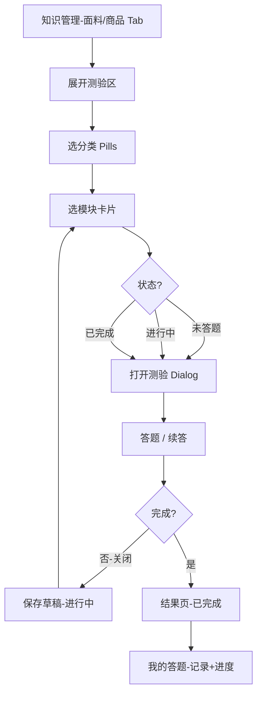

# 凯施迪企业信息系统 — UI 产品设计方案（无后端阶段）

> 版本：2026-05-29  
> 目标：在**不接后端**的前提下，把界面、交互、信息架构全部定稿，形成可演示、可内训的完整前端产品。  
> 与 `UI改进汇总.md` 的关系：本文是**产品蓝图**（做什么、长什么样）；改进汇总是**评审清单**（怎么改、技术细节）。

---

## 1. 设计原则

| 原则 | 说明 |
|------|------|
| 真实可用 | 不做「点了没反应」的入口；未上线功能用「即将上线」或隐藏，不用假按钮 |
| 店员优先 | 单手操作、少滚动、货号/面料名一眼能搜到；桌面店务屏与手机都要顺 |
| 主从一致 | 列表 + 详情统一用 `FabricKnowledge` 范式：左选右看，手机用 Drawer |
| 状态可见 | 测验、通知、文档、图片加载都要有明确状态（空/加载/失败/完成） |
| 为后端留缝 | 登录、答题、收藏等用统一 Service 接口，日后只换实现不换 UI |

---

## 2. 信息架构（定稿）

### 2.1 一级导航（侧栏，已确定）

```
工作台 /
公司文化 /culture
知识管理 /knowledge
商品速查 /products
我的答题 /quiz-records
新闻通知 /news
更新公告 /changelog
```

登录页 `/login`（无侧栏）。

### 2.2 知识管理二级结构（Tab 分组，保持）

**产品资料**

| Tab key | 名称 | 内容类型 |
|---------|------|----------|
| fabric | 面料知识 | 主从阅读 + 页内测验 |
| product | 商品资料 | 主从阅读 + 页内测验 |
| management | 管理制度 | 文档列表 + 预览 |
| brand | 品牌介绍 | 文档/图文 |
| store-image | 门店风采 | 相册 + 培训文档 |

**培训话术**

| Tab key | 名称 |
|---------|------|
| manager | 店长培训 |
| sales | 销售话术 |
| new-staff | 新员工 |

### 2.3 暂不纳入本阶段路由（避免半成品）

| 模块 | 建议 |
|------|------|
| `Track.tsx` 业绩看板 | **方案 A**：接入侧栏「我的业绩」；**方案 B**：从仓库移除。UI 定稿前二选一，不长期悬空 |
| 顶栏全局搜索 | 本阶段做 **Command 搜索弹层**（见 4.1），不做假输入框 |
| 侧栏主题切换 | 移除 Moon 按钮，或整站暗色一次做完 |

---

## 3. 全局框架设计

### 3.1 布局线框

```
┌──────────┬─────────────────────────────────────────────┐
│ 侧栏     │ 顶栏：菜单(移动) | 搜索 Ctrl+K | 用户 | 退出   │
│ 200px    ├─────────────────────────────────────────────┤
│          │ 面包屑（可选）                               │
│ 导航     │ ┌─────────────────────────────────────────┐ │
│          │ │ 页面标题 + 副标题                        │ │
│          │ │ 主内容 max-w-[1200px] 或 1400px(知识)   │ │
│          │ └─────────────────────────────────────────┘ │
└──────────┴─────────────────────────────────────────────┘
```

### 3.2 顶栏（定稿交互）

| 元素 | 行为 |
|------|------|
| 搜索 | 点击或 `Ctrl+K` 打开 **全站搜索 Command**：商品货号/名称、面料名、新闻标题、文档标题、门店相册 |
| 用户区 | 显示姓名；点击可下拉：我的答题、退出（不做设置页占位） |
| 移动菜单 | 打开侧栏 Sheet |

### 3.3 共享布局组件（待实现，统一全站）

**`MasterDetailLayout`**（标杆：`FabricKnowledge`）

| 区域 | 桌面 | 移动 |
|------|------|------|
| 左栏 | 宽 260–320px，筛选 + 列表，独立滚动 | 全宽列表 |
| 右栏 | `flex-1`，详情头 + Tab/模块条 + 内容滚动 | 点击项 → 全屏 Drawer |
| 高度 | 父级 `min-h-[calc(100dvh-顶栏)]`，内容区 `flex-1 min-h-0` | 同左 |

**适用页面**：商品速查、管理制度、销售话术、门店风采（文档+相册）、店长培训等。

**`BrandHero`**（已有）

- 用于：工作台欢迎、公司文化品牌区、重要公告置顶（可选）

**`PageHeader`**

- 标题、副标题、右侧操作区（如「我的答题」链接）
- 统一 `useDocumentTitle`

---

## 4. 分页面功能定稿

### 4.1 登录 `/login`

| 项目 | 定稿 |
|------|------|
| 字段 | 工号、密码 |
| 提示 | 底部小字：「账号由总部开通，不支持注册」 |
| 错误 | 工号或密码错误 / 账号未开通 |
| 记住 | 本阶段仅 localStorage 会话；UI 不做「记住我」勾选（避免误解为长期安全） |

---

### 4.2 工作台 `/`

```
┌─ BrandHero：欢迎 {姓名} · 门店 ─────────────────────┐
│ 一行摘要：面料测验进度 · 商品测验进度（可点击）          │
└──────────────────────────────────────────────────────┘
┌─ 快捷入口（4 宫格 Link）─────────────────────────────┐
│ 公司文化 | 知识管理 | 商品速查 | 新闻通知              │
└──────────────────────────────────────────────────────┘
┌─ 我的答题（卡片入口）────────────────────────────────┐
┌─ 最新通知（4 条，整条可点）──────────────────────────┐
┌─ 更新公告（2 条）──────────────────────────────────┐
```

**待定增强（P1 UI）**

- 未读通知角标（localStorage 记录已读 id）
- 「继续学习」：最近一次打开的面料/商品（localStorage）

---

### 4.3 公司文化 `/culture`

| 区块 | 定稿 |
|------|------|
| 品牌介绍 | 首段常显，其余「展开更多」 |
| 门店风采 | 相册卡片网格 → 跳转知识管理-门店风采并打开对应相册 |

---

### 4.4 知识管理 `/knowledge`

#### 4.4.1 页顶

- 标题「知识管理」+ 副标题
- **Sticky Tab 条**（产品资料 / 培训话术分组），当前 Tab 小字提示（移动端）

#### 4.4.2 面料知识 / 商品资料（已定稿方向）

```
┌─ 知识测验区（可折叠，默认收起）───────────────────────┐
│ 步骤1：分类/系列 Pills                               │
│ 步骤2：模块卡片网格 + 状态标签（未答题/进行中/已完成）  │
└──────────────────────────────────────────────────────┘
┌─ MasterDetailLayout ─────────────────────────────────┐
│ 左：分类筛选 + 列表                                   │
│ 右：紧凑标题 + 模块 Pills + 内容区（大滚动区）          │
└──────────────────────────────────────────────────────┘
```

**测验弹窗（仅答题 + 结果）**

| 状态 | UI |
|------|-----|
| 答题中 | 进度条、题号、选项、确认/下一题 |
| 结果 | 得分环、评语、重测 / 继续其他模块 / 更换分类 |
| 进行中续答 | **P0 UI**：打开弹窗时恢复草稿题目与已答记录 |

#### 4.4.3 门店风采 Tab

**左栏列表项类型**

| 类型 | 图标/缩略图 | 右栏内容 |
|------|-------------|----------|
| 开业相册 | 封面图 | 网格图 + 灯箱 |
| PDF/XLS 文档 | 文件类型色块 | 简介 + 预览/下载（现有） |

**分类筛选**：全部 | 开业活动 | 陈列实操 | 广告画 | 巡店考核

#### 4.4.4 其他文档类 Tab

- 统一为：搜索 + 分类 Pills + 左文档列表 + 右详情（与 `StoreImageSystem` 对齐）
- Excel：提示浏览器打开/下载，不强行 iframe

---

### 4.5 商品速查 `/products`

与 `ProductKnowledge` 对齐 **MasterDetailLayout**：

| 左栏 | 右栏 |
|------|------|
| 搜索框 | 货号标签 + 品名 |
| 可折叠筛选：季节/系列/颜色 | 大图 + 基础信息栅格 + 面料/工艺/洗护/场景 |
| 商品列表（缩略图 + 货号） | |

**必做 UI**

- 图片 `onError` 占位图
- 列表过长：虚拟滚动或分页（>100 条时）

**可选**

- 货号复制按钮 + Toast（sonner）
- URL 支持 `?code=122DA...` 深链打开商品

---

### 4.6 我的答题 `/quiz-records`

| Tab | 内容 |
|-----|------|
| 标签与模块进度 | 按面料/商品 → 标签 → 模块行 + 最高分徽章 |
| 测验记录 | 表格：时间、类型、标签、模块、得分、正确数 |

**增强（P1）**

- 模块行显示与知识页一致的 **未答题 / 进行中 / 已完成**
- 点击模块行 → 跳转知识管理并展开测验区、预选标签+模块

---

### 4.7 新闻通知 `/news` + `/news/:id`

| 列表 | 详情 |
|------|------|
| 置顶标识、标签色、摘要、时间 | 封面图、标题、作者、时间 |
| 整卡 `Link`（非 div onClick） | 正文：Markdown 渲染（`react-markdown`） |
| 已读/未读样式（localStorage） | 分享：复制链接 + Toast |

---

### 4.8 更新公告 `/changelog`

- 版本时间线（现有）
- 每条：版本号、日期、变更类型标签（新功能/修复/优化）

---

## 5. 全站搜索（Command Palette）— 本阶段核心新功能

**触发**：顶栏搜索框、`Ctrl+K` / `⌘+K`

**搜索范围（前端索引，启动时构建）**

| 类型 | 字段 | 跳转 |
|------|------|------|
| 商品 | 货号、名称、面料 | `/products` + 选中 |
| 面料 | 名称、编码、分类 | `/knowledge` fabric Tab + 选中 |
| 新闻 | 标题 | `/news/:id` |
| 文档 | 标题、标签 | `/knowledge` 对应 Tab |
| 门店相册 | 标题、地点 | `/knowledge` store-image + 相册 |

**结果 UI**

- 分组展示：商品 / 面料 / 新闻 / 文档 / 门店
- 键盘 ↑↓ 选择，Enter 跳转
- 无结果：提示 + 建议去商品速查

---

## 6. 设计系统（精简令牌，定稿）

在 `tailwind.config.js` 扩展，页面逐步替换硬编码：

| 令牌 | 值 | 用途 |
|------|-----|------|
| primary | `#1890FF` | 主按钮、链接、激活 Tab |
| success | `#52C41A` | 已完成、正确选项 |
| warning | `#FAAD14` | 进行中、注意事项 |
| error | `#F5222D` | 错误示范、删除 |
| text.primary | `#262626` | 标题正文 |
| text.secondary | `#595959` | 次要正文 |
| text.tertiary | `#8C8C8C` | 说明、辅助 |
| border | `#F0F0F0` | 卡片边框 |
| surface | `#FAFAFA` | 浅底区块 |

**圆角**：Chip `rounded-full`，卡片 `rounded-lg`，详情块 `rounded-xl`  
**阴影**：卡片 `shadow-xs`，hover 略抬升；Dialog `shadow-xl`

---

## 7. 交互与状态规范

### 7.1 弹层

| 场景 | 组件 | 规则 |
|------|------|------|
| 测验 | Dialog | Esc 关闭、焦点陷阱、关闭时保存草稿 |
| 文档预览 | Dialog 全屏或大窗 | 与测验 z-index 统一 `z-50` |
| 移动详情 | Drawer 92vh | 下滑关闭 |
| 图片灯箱 | 全屏遮罩 | 左右切换、Esc 关闭 |

### 7.2 反馈

| 操作 | 反馈 |
|------|------|
| 复制货号/链接 | sonner Toast |
| 表单错误 | 字段下红色文案 |
| 列表空 | 图标 + 说明 + 引导操作 |
| 图片失败 | 占位图 +「加载失败」 |

### 7.3 加载

- 本阶段数据本地同步，一般无需 Skeleton
- 文档预览、大图：按钮「加载中…」禁用态即可

---

## 8. 功能清单与状态（UI 视角）

| 功能 | 状态 | 下一步 UI |
|------|------|-----------|
| 登录/退出 | ✅ 已有 | 文案、错误态统一 |
| 面料/商品阅读 | ✅ 已有 | 统一 MasterDetailLayout |
| 知识测验 | ✅ 已有 | **断点续答**、进度刷新 |
| 测验状态标签 | ✅ 已有 | 同步到「我的答题」 |
| 门店开业相册 | ✅ 已有 | 常平 PNG 可转 JPEG 统一 |
| 文档预览 PDF/DOCX | ✅ 已有 | 纳入 Dialog 规范 |
| 新闻列表/详情 | ✅ 已有 | Link 化、Markdown |
| 全局搜索 | ❌ 占位 | **Command Palette** |
| 通知已读 | ❌ | localStorage 已读 |
| 商品深链 | ❌ | URL query |
| 业绩看板 Track | ❌ 未路由 | 接入或删除 |
| 断点续答 | ❌ | 读草稿恢复题目 |
| 设计令牌替换 | 🟡 部分 | 分批替换 hex |
| 暗色模式 | ❌ | 移除入口或全做 |

---

## 9. 实施分期（仅前端 UI，建议顺序）

### 第一期：定框架、消假功能（约 1 周）

1. 顶栏 Command 搜索（替代禁用搜索框）
2. 抽取 `MasterDetailLayout`，商品页接入
3. 移除/实现 Track：二选一
4. 统一 Dialog/Drawer（商品详情、DocViewer）
5. 测验 **断点续答**
6. 更新 `app/README.md` 演示说明

### 第二期：体验抛光（约 1 周）

1. 新闻 Markdown + 已读态
2. 我的答题 ↔ 知识测验联动跳转
3. 工作台：继续学习、通知角标
4. 商品图失败占位、复制货号 Toast
5. 面包屑 + 路由 title 全覆盖
6. 设计令牌替换主色（高频页面）

### 第三期：一致性与可选（约 1 周）

1. 其余知识 Tab 对齐 MasterDetailLayout
2. 筛选区展开动画、`prefers-reduced-motion`
3. 门店图批量 WebP/JPEG 规范脚本入 README
4. 无障碍：弹层焦点、列表 aria
5. 路由懒加载（为性能，不改变 UI）

---

## 10. 页面流示意（测验闭环）



---

## 11. 产品决策（已确认 2026-05-29）

| # | 决策 |
|---|------|
| 1 | **不做**业绩看板；已移除 `Track.tsx` |
| 2 | **做**全局搜索（顶栏点击 + `Ctrl+K`） |
| 3 | **仅浅色主题**，不做暗色/夜间切换 |
| 4 | 知识管理改为 **左侧二级菜单** |
| 5 | 测验区 **默认折叠** |
| 6 | 门店风采：**公司文化卡片 + 跳转知识管理** |

---

## 12. 修订记录

| 日期 | 说明 |
|------|------|
| 2026-05-29 | 初版：无后端阶段 UI/功能蓝图，与现有实现对齐 |
| 2026-05-29 | 记录已确认决策；实现全局搜索与知识管理左侧导航 |
